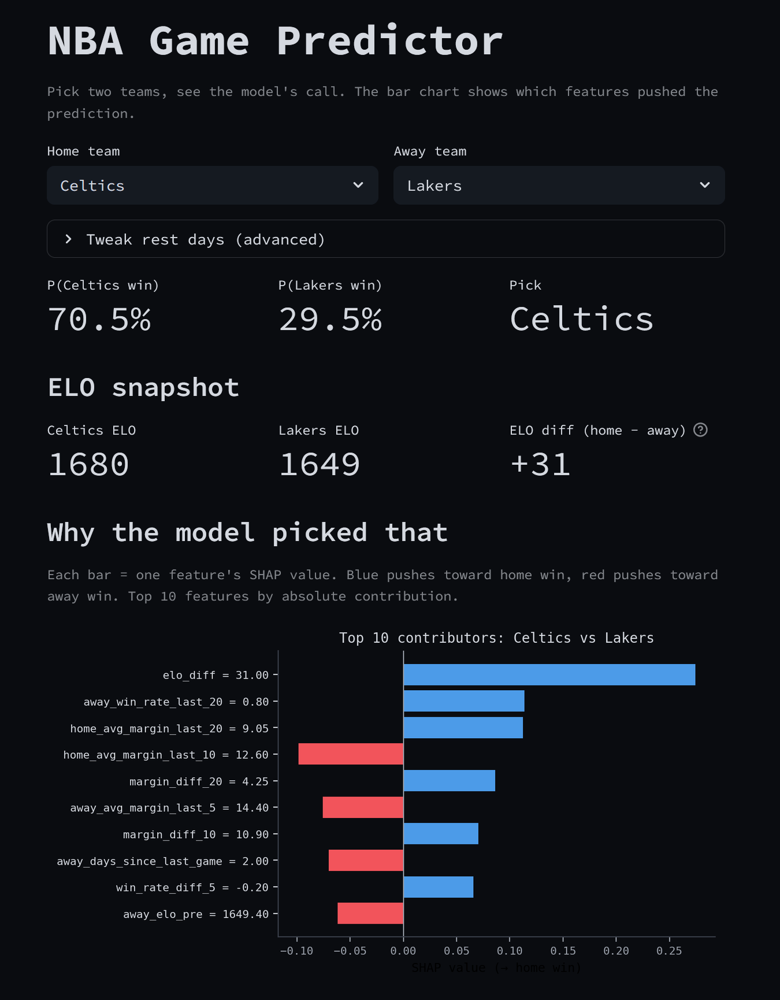

# NBA Game Predictor

A personal machine-learning project where I try to predict the outcomes of NBA games, playoff series, and championships, using historical data from [Kaggle](https://www.kaggle.com/datasets/eoinamoore/historical-nba-data-and-player-box-scores) that goes back to the first BAA season in 1946.

## Why basketball?

The idea is simple: use historical statistics to predict future game outcomes. But why basketball, and not tennis, football, or biathlon?

It's a team sport with a long season. Unlike individual sports, the result does not depend on one athlete having a good or bad day. With five players on the court and 82 regular-season games, individual variance gets averaged out, which suits a statistical model.

High-scoring games are also more forgiving to model. An NBA game typically ends 110–105, not 2–1. If my model is off by a couple of baskets, the predicted winner often still holds. In football, a single goal swing flips the result entirely. More scoring events means the final score sits closer to the true performance gap between the teams.

And the data is easy to come by. The NBA has tracked detailed statistics for decades, so I can work with clean, well-documented datasets covering almost 80 years.

## Key results

| Metric | Value | Context |
|---|---:|---|
| Out-of-sample game accuracy | **65.0 %** | Full 63-feature model, test set 2019–2025 |
| Walk-forward backtest accuracy | **67.6 %** | 66 seasons (1960–2025), retrained per year |
| Walk-forward AUC | **0.71** | Stable across all eras |
| Champion = model's top pick | **52.5 %** | 21/40 backtested seasons |
| Champion in model's top 3 | **75 %** | 30/40 seasons |
| Champion in model's top 5 | **92.5 %** | 37/40 seasons |
| Avg. probability assigned to actual champion | **34 %** | 5.4× the 6.25 % random baseline |

## Pipeline overview

| # | Notebook | What it does |
|---|---|---|
| 01 | `01_data_exploration.ipynb` | EDA on 73k games: home advantage trends, era effects, missing data |
| 02 | `02_feature_engineering.ipynb` | ELO ratings, rolling form (5/10/20 games), head-to-head, rest days, back-to-backs |
| 03 | `03_baseline_model.ipynb` | Trivial baseline → logistic regression → XGBoost on a fixed 2019 split |
| 04 | `04_backtesting.ipynb` | Walk-forward validation: retrain each season, predict the next |
| 05 | `05_player_features.ipynb` | Box-score aggregation (shooting %, plus/minus, turnovers) |
| 06 | `06_advanced_features.ipynb` | Star availability and strength-of-schedule features |
| 07 | `07_series_simulation.ipynb` | Best-of-7 Monte Carlo with the NBA 2-2-1-1-1 home pattern |
| 08 | `08_bracket_simulation.ipynb` | Full bracket Monte Carlo (5,000 sims/season, 40 seasons backtested) |
| 09 | `09_conditional_predictions.ipynb` | Probability updating as playoff rounds resolve |
| 10 | `10_live_demo_2025.ipynb` | Live championship probabilities for the ongoing 2025–26 playoffs |

## Results

### Walk-forward accuracy over 66 seasons


Accuracy sits around 65–70 % across eight decades of NBA basketball. The dip in 2020 (Covid empty-arena games) is clearly visible: home advantage collapsed, and a model trained on eras with stronger home court struggled to adjust.

### Best-of-7 amplifies any edge


A 60 % per-game probability becomes roughly 71 % over a best-of-7 series. This is why series-level predictions are stronger than game-level predictions.

### Where does the actual champion land in the model's ranking?


Across 40 backtested seasons (1983–2024), the actual NBA champion was the model's top pick 52.5 % of the time and within the top 3 picks 75 % of the time. The random baseline is 6.25 %.

### Confidence evolves through the playoffs


Average probability assigned to the eventual champion: 34 % before the playoffs, 37 % after round 1, 45 % after the conference semis, 66 % in the finals. Most of the uncertainty lives in round 1. Once the final eight are set, the model gets much sharper.

### Live: 2025–26 playoffs (round 1 in progress)


Current top picks, using the real round-1 matchups and current series scores, then re-seeding by ELO for the later rounds: Thunder 58.5 %, Spurs 21.6 %, Celtics 11.2 %, Pistons 3.2 %, Cavaliers 1.7 %. The Thunder jumped after going up 3-0 against the Suns; once a team is one win away in a best-of-7, the conditional probability tilts hard.

## What I learned

Building the model was the easy part. Evaluating it without fooling myself turned out to be the more interesting work.

ELO does most of the heavy lifting. In the compact baseline model the ELO difference alone accounts for over 40 % of the gain-based feature importance; in the full 63-feature model it is still the top feature at about 26 %. Rolling form, head-to-head and rest days add incremental value, but ELO with a home-court adjustment gets you most of the way. A well-chosen simple feature can beat a long list of engineered ones.

Walk-forward validation changed the picture. A single train/test split gives one accuracy number that looks fine and hides everything interesting. Retraining for every season from 1960 to 2025 and predicting only the next year showed that modern NBA seasons are noticeably harder to predict than older ones. The single-split version of this story would have missed that entirely.

More features helped less than I expected. The first version used 27 features and reached 64.1 % out-of-sample accuracy; 24 box-score features brought it to 64.8 %, and twelve more advanced features landed at 65.0 %. The later additions mostly improved log-loss and AUC rather than the binary call: more honest probabilities, few changed predictions.

Which is, I think, the real finding: team-level historical data caps out around 65 % per-game accuracy. Breaking through would need information that ELO and form cannot absorb, like real-time injury status, confirmed lineups, or player tracking data. Knowing where the ceiling is is part of knowing what the model is.

## Possible next steps

Hyperparameter tuning with proper nested cross-validation (Optuna), probability calibration before feeding per-game predictions into the bracket simulator, and a real player-level feature set built from injury reports and confirmed lineups. I have started experimenting with the first two; nothing publishable yet.

## Interactive demo



A small Streamlit app: pick two teams, get the predicted win probability and a SHAP breakdown of the features that pushed it there.

```bash
streamlit run Demo.py
```

Needs the processed dataset from notebook 02 and the trained model from notebook 03.

## Tech stack

`Python` · `pandas` · `numpy` · `XGBoost` · `scikit-learn` · `matplotlib` · `seaborn` · `pyarrow` · `joblib` · `streamlit`

## Reproduce

```bash
git clone https://github.com/klp-data/nba-game-predictor.git
cd nba-game-predictor
pip install -r requirements.txt
# Download the Kaggle dataset below into data/raw/
jupyter notebook notebooks/
# Run 01 -> 10 in order
```

Dataset: [Historical NBA Data and Player Box Scores](https://www.kaggle.com/datasets/eoinamoore/historical-nba-data-and-player-box-scores) on Kaggle (Eoin Moore). Roughly 73,000 games and 1.6 M player box-score rows, 1946 to today.
