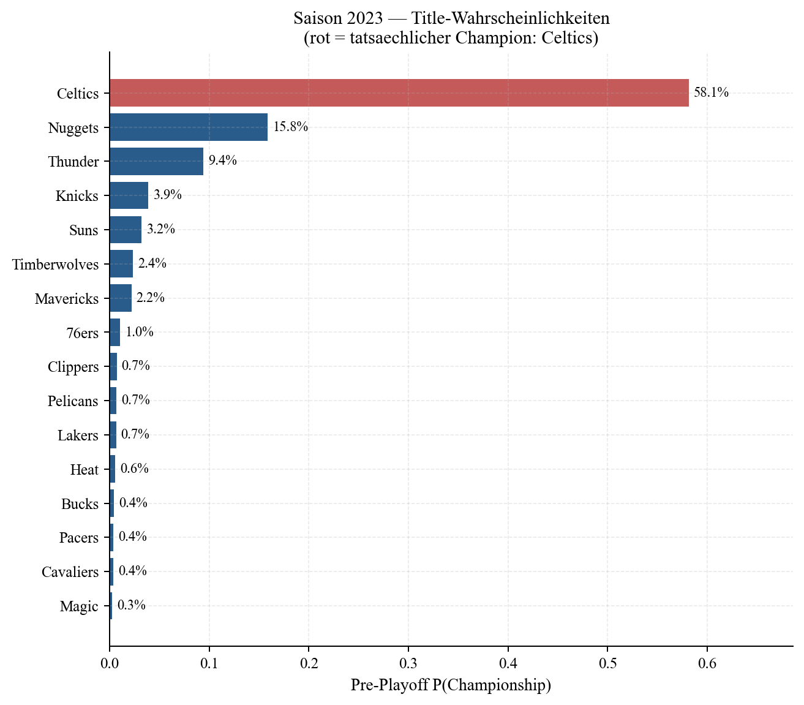
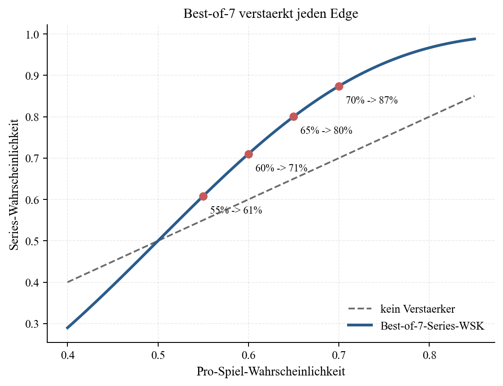
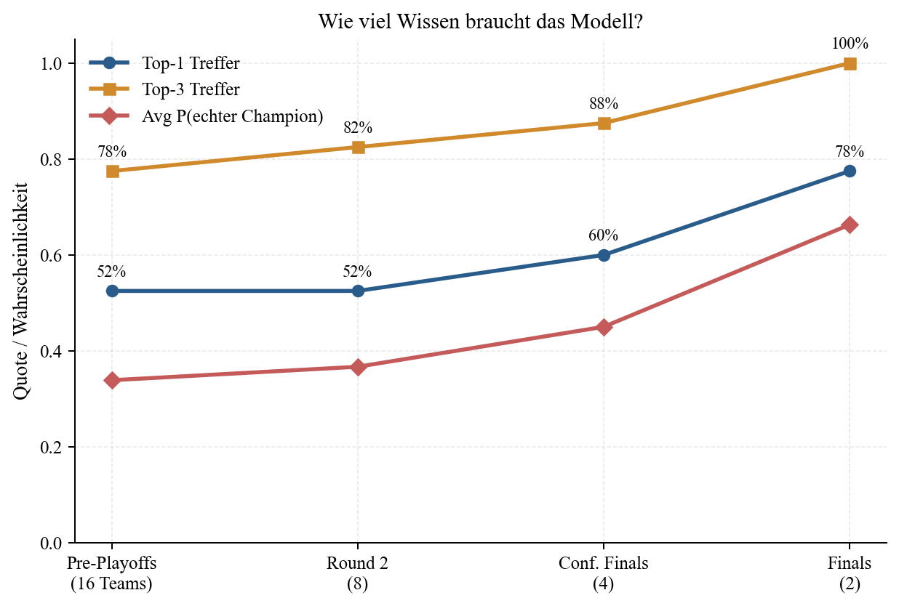

# NBA Game Predictor

Machine-Learning-Pipeline zur Vorhersage von NBA-Spiel-, Series- und Championship-Ausgängen auf Basis historischer Daten von 1947 bis heute.

## Highlights

| Metrik | Wert |
|---|---|
| Game-Level Accuracy (XGBoost, out-of-sample 2019+) | **64.8 %** |
| Game-Level AUC | **0.705** |
| Series-Level Accuracy (Best-of-7) | **~74 %** |
| **Pre-Playoff Top-1 Champion-Pick (40 Saisons Backtest)** | **52.5 %** |
| Pre-Playoff Top-3 Hit-Rate | **75 %** |
| Mittlere Modell-Sicherheit beim *tatsächlichen* Champion (vor Playoff-Beginn) | **34 %** *(Random-Baseline: 6.25 %)* |

In 40 historischen Saisons hatte unser Pre-Playoff-Modell den späteren Champion in **75 %** der Fälle in seinen Top-3 Picks und in **52.5 %** auf Platz 1 — basierend allein auf ELO und Bracket-Struktur.

## Beispiel: Saison 2023-24



Das Modell gab den Boston Celtics 58.1 % Title-Chance vor Playoff-Beginn. Sie gewannen die Finals 4-1 gegen Dallas.

## Warum Best-of-7 wichtig ist

Ein moderater Pro-Spiel-Edge wird im Series-Format überproportional verstärkt:



65 % Pro-Spiel-Wahrscheinlichkeit → 80 % Series-Wahrscheinlichkeit. Genau diese Verstärkung macht den Sprung von einem schwachen Game-Predictor zu einem brauchbaren Championship-Predictor möglich.

## Wo die Unsicherheit sitzt

Wenn wir progressiv mehr Rundenausgänge kennen, verbessert sich die Treffer-Quote:



Der größte Sprung kommt zwischen *Round 2* und *Conference Finals* — sobald die letzten 4 Teams stehen, weiß das Modell sehr genau, wer den Titel holt.

## Architektur

```
nba-game-predictor/
├── src/                     # Wiederverwendbare Module
│   ├── elo.py               # ELO-System (Pre-Game-Ratings, Win-Probabilities)
│   ├── series.py            # Best-of-7-Simulation (analytisch + Monte Carlo)
│   ├── bracket.py           # Bracket-Konstruktion + Championship-Probabilities
│   └── plot_style.py        # Publication-ready matplotlib-Theme
├── notebooks/               # Entwicklungsverlauf in 9 Schritten
│   ├── 01_data_exploration.ipynb
│   ├── 02_feature_engineering.ipynb
│   ├── 03_baseline_model.ipynb
│   ├── 04_backtesting.ipynb
│   ├── 05_player_features.ipynb
│   ├── 06_advanced_features.ipynb
│   ├── 07_series_simulation.ipynb
│   ├── 08_bracket_simulation.ipynb
│   └── 09_conditional_predictions.ipynb
├── scripts/
│   └── generate_highlight_plots.py
├── assets/                  # Highlight-PNGs für README
├── data/                    # gitignored (1.8 GB Kaggle-Dataset)
├── models/                  # gitignored (trainierte Modelle)
├── requirements.txt
└── README.md
```

## Pipeline

1. **EDA** — 73 000 NBA-Spiele 1947-2025, Home-Win-Rate 61.6 %, Score-Drift über die Jahrzehnte.
2. **Feature Engineering** — Rolling Team-Form (5/10/20 Spiele), Head-to-Head (5 Spiele), Rest Days, Back-to-Back-Detektion, ELO-Rating (`K=20`, Home-Adv 100).
3. **Baseline-Modelle** — Logistic Regression als Sanity-Check, XGBoost als Hauptmodell.
4. **Walk-Forward-Backtesting** — Modell jedes Jahr neu trainiert auf allen vorherigen Saisons, getestet auf der Folgesaison.
5. **Player Box-Score-Features** — Team-aggregierte FG%, 3P%, Plus/Minus der Top-3 Minutenverbringer (rolling).
6. **Advanced Features** — Top-5-Star-Verfügbarkeit, Strength-of-Schedule-gewichtete Form, Quality Wins.
7. **Series-Simulation** — Best-of-7 mit NBA-Heimrechts-Pattern (2-2-1-1-1).
8. **Full Bracket Monte Carlo** — Kompletter Playoff-Tree, 10 000 Simulationen pro Saison, Championship-Wahrscheinlichkeit pro Team.
9. **Conditional Predictions** — Wie verändert sich die Treffer-Quote, wenn frühere Runden bekannt sind?

## Tech-Stack

Python · pandas · scikit-learn · XGBoost · matplotlib · seaborn · Jupyter

## Setup

```bash
git clone https://github.com/klp-data/nba-game-predictor.git
cd nba-game-predictor
python -m venv .venv
.venv\Scripts\activate          # Windows
pip install -r requirements.txt
```

Daten von [Kaggle](https://www.kaggle.com/datasets/eoinamoore/historical-nba-data-and-player-box-scores) herunterladen und nach `data/raw/` entpacken.

## Reproduzieren

```bash
# Notebooks der Reihe nach ausführen (01 → 09)
jupyter lab

# Highlight-Plots fürs README neu generieren
python scripts/generate_highlight_plots.py
```

## Methodische Hinweise

- **Kein Data Leakage:** alle Rolling-Features verwenden `.shift(1)` vor der Aggregation. ELO ist chronologisch fortgeschrieben. Walk-Forward-Backtest trainiert ausschließlich auf Spielen *vor* dem Test-Zeitraum.
- **Walk-Forward statt Random Split:** Sport-Daten sind zeitabhängig, ein Random Split wäre Augenwischerei.
- **Series-Simulation:** Best-of-7 mit NBA-2-2-1-1-1-Format und Home-Court-Adjustment von ~7 Prozentpunkten (entspricht ELO-Heimvorteil 100 / 400 ≈ 7 %).

## Was bewusst nicht drin ist

- **Live-Verletzungsdaten** (würde echtes Scraping brauchen)
- **Vegas-Quoten / ROI-Backtest** mit echten Lines
- **Player-Tracking-Daten** (NBA proprietär)

Diese Limitierungen erklären den Abstand zur theoretischen Decke (~70 % Game-Accuracy).

## Lizenz

MIT — frei zur Nutzung und Modifikation.
