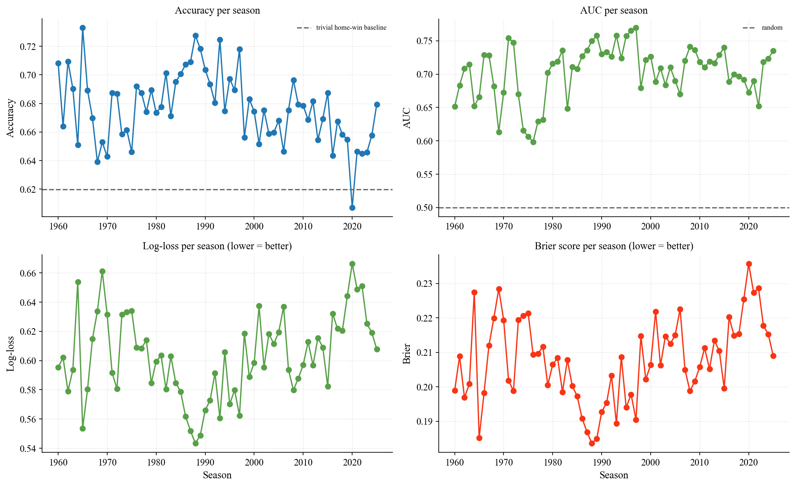
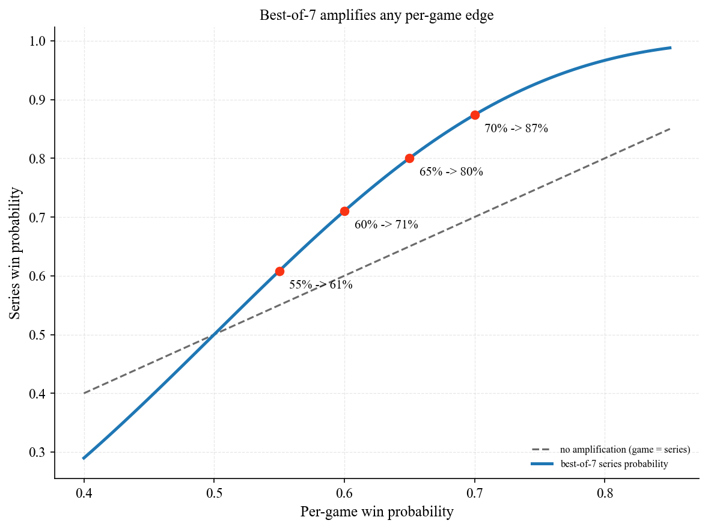
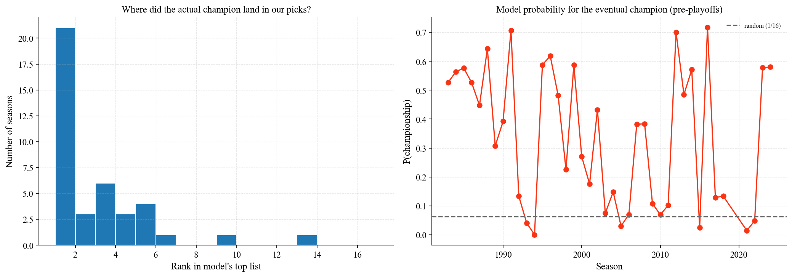
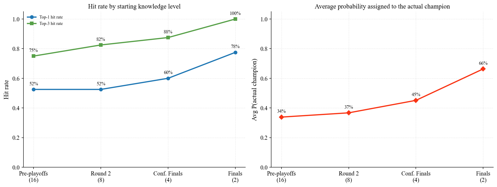
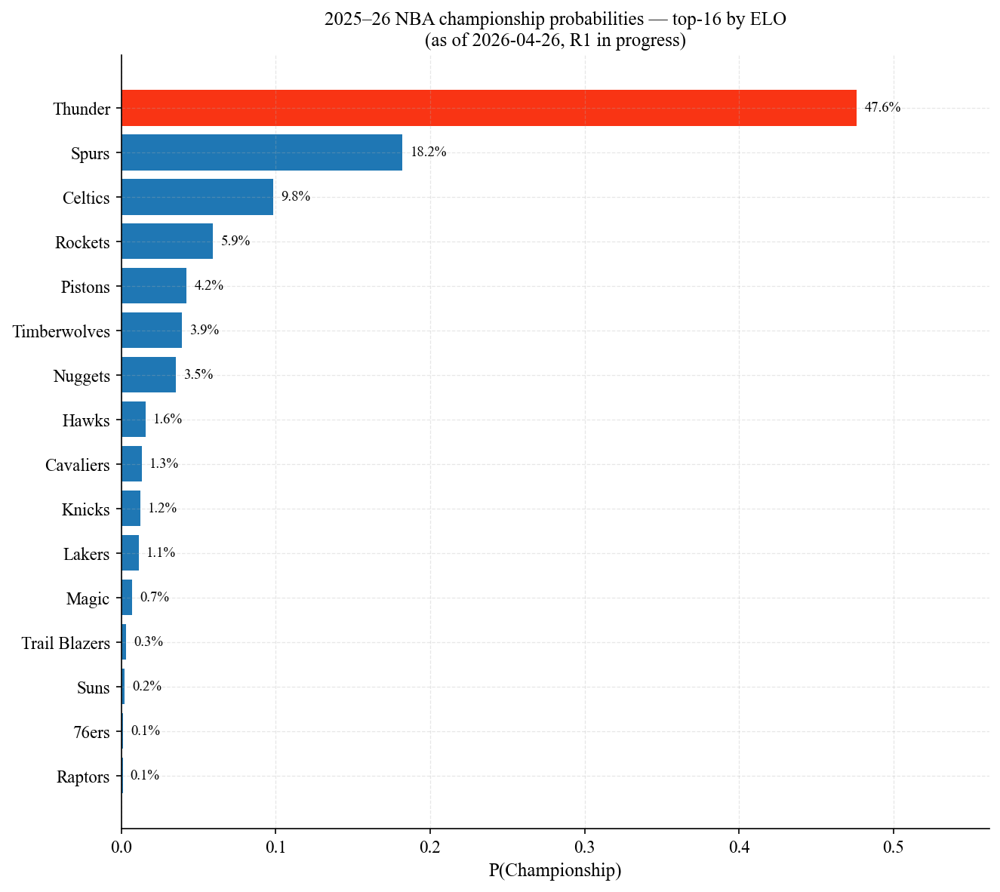

# NBA Game Predictor

End-to-end machine learning pipeline predicting NBA game outcomes, with full historical backtesting and Monte Carlo playoff simulation.

**73,224 games · 80 seasons (1946–2026) · ELO + XGBoost + Monte Carlo**

---

## Key results

| Metric | Value | Context |
|---|---:|---|
| Out-of-sample game accuracy | **64.8 %** | Test set: 2019–2025 |
| Walk-forward backtest accuracy | **68.0 %** | 66 seasons, retrained per year |
| Walk-forward AUC | **0.71** | Stable across all eras |
| Top-3 NBA champion hit rate | **75 %** | 30/40 seasons backtested |
| Top-5 NBA champion hit rate | **92.5 %** | 37/40 seasons backtested |
| Avg. P assigned to actual champion | **34 %** | 5.5× random baseline (6.25 %) |

---

## Pipeline overview

| # | Notebook | What it does |
|---|---|---|
| 01 | `01_data_exploration.ipynb` | EDA on 73k games — home advantage trends, era effects, missing data |
| 02 | `02_feature_engineering.ipynb` | ELO ratings, rolling form (5/10/20 games), head-to-head, rest days, back-to-backs |
| 03 | `03_baseline_model.ipynb` | Trivial baseline → Logistic Regression → XGBoost on a fixed 2019 split |
| 04 | `04_backtesting.ipynb` | Walk-forward validation: retrain model each season, predict the next |
| 05 | `05_player_features.ipynb` | Box-score aggregation (shooting %, plus/minus, turnovers) |
| 06 | `06_advanced_features.ipynb` | Star availability + strength-of-schedule features |
| 07 | `07_series_simulation.ipynb` | Best-of-7 Monte Carlo with NBA 2-2-1-1-1 home court |
| 08 | `08_bracket_simulation.ipynb` | Full bracket Monte Carlo (10k sims × 40 seasons) |
| 09 | `09_conditional_predictions.ipynb` | Probability updating as playoff rounds resolve |
| 10 | `10_live_demo_2025.ipynb` | Live championship probabilities for the ongoing 2025–26 playoffs |

---

## Selected results

### Walk-forward accuracy over 66 seasons


Accuracy is stable around 65–70 % across eight decades of NBA basketball. The dip in 2020 (Covid empty-arena games) is visible — home advantage collapsed, and the model struggled because it had been trained on eras with stronger home court.

### Best-of-7 amplifies any edge


A 60 % per-game probability becomes ≈ 71 % over a best-of-7 series. This is why series-level predictions are noticeably stronger than game-level predictions.

### Where does the actual champion land in our top picks?


Across 40 backtested seasons (1983–2024), the actual NBA champion was the model's top pick **52.5 %** of the time and within its top 3 picks **75 %** of the time. Random baseline: 6.25 %.

### Confidence evolves through the playoffs


Average probability assigned to the actual champion: 34 % pre-playoffs → 37 % after round 1 → 45 % after the conference semis → 66 % in the finals. Most of the uncertainty lives in round 1 — once the final 8 are set, the model gets noticeably sharper.

### Live: 2025–26 playoffs (R1 in progress)


Current top picks (top-16 by ELO seeded into a standard bracket):
Thunder 47.6 %, Spurs 18.2 %, Celtics 9.8 %, Rockets 5.9 %, Pistons 4.2 %.

---

## What worked and what didn't

**Worked:**
- ELO with a 100-point home-court adjustment carries the model. It captures ~35 % of total feature importance on its own and is the foundation for all downstream simulations.
- The Best-of-7 Monte Carlo amplifies any per-game edge into a sharper series prediction. Bracket-level top-3 hit rate (75 %) is materially better than per-game accuracy (65 %).
- Walk-forward validation gives a much more honest performance estimate than a single train/test split — and reveals that modern NBA seasons are *harder* to predict (home advantage has shrunk from ~66 % in the 60s to ~55 % today).

**Didn't (honest negative findings):**
- **Player box-score features added almost nothing.** Old model 64.23 % → with 24 added features 64.86 %. ELO and rolling form already encode "this team scores well and protects the ball" indirectly — the box-score features were largely redundant.
- **Star availability and strength-of-schedule features were marginal too.** Full model with 63 features tops out at 64.82 % accuracy — within noise of the 27-feature baseline. AUC and log-loss did improve modestly, so the new features made probabilities slightly more honest, just not the binary calls.

**The ceiling lesson:** team-level historical data appears to converge around 65 % accuracy on NBA games. Breaking past it likely requires:
- Real-time injury status and confirmed starting lineups
- Player tracking / advanced metrics not in the box score
- Hyperparameter tuning with proper nested CV (Optuna)

---

## Tech stack

`Python` · `pandas` · `numpy` · `XGBoost` · `scikit-learn` · `matplotlib` · `seaborn` · `pyarrow` · `joblib`

Methodology: walk-forward time-series CV, ELO rating system, Monte Carlo simulation (10k iterations), feature ablation, probability calibration analysis.

---

## Reproduce

```bash
git clone https://github.com/klp-data/nba-game-predictor.git
cd nba-game-predictor
pip install -r requirements.txt
# Download the Kaggle "NBA Database" dataset to data/raw/
jupyter notebook notebooks/
# Run 01 → 10 in order
```

Dataset: [NBA Database on Kaggle](https://www.kaggle.com/datasets/wyattowalsh/basketball) (Wyatt Walsh).
